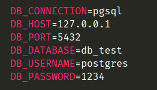
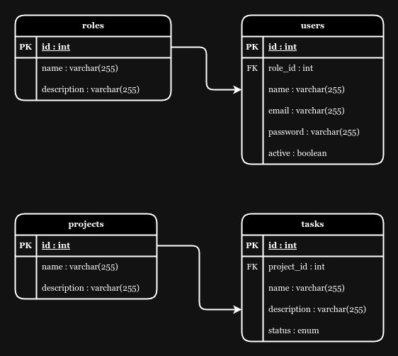

## About Laravel

Laravel is a web application framework with expressive, elegant syntax. We believe development must be an enjoyable and creative experience to be truly fulfilling. Laravel takes the pain out of development by easing common tasks used in many web projects, such as:

## Requisitos para el proyecto
1 - Php8.2  
2 - Laravel 10  
3 - PostgreSQL 14 (En mi caso)

## Como instalar el proyecto
1 - git clone [url_del_repositorio]  
2 - composer install  
3 - cp .env.example .env  
4 - php artisan key:generate  
5 - php artisan jwt:secret  

antes de correr las migraciones hay que configurar el archivo ".env" con las credenciales de la BBDD (En mi caso es así)

Nota: Colocar su usuario y su contraseña como corresponda

6 - php artisan migrate --seed

## Configuracion inicial
1 - El proyecto tiene dos roles registrados "Admin" y "Usuario".  
2 - El proyecto tiene dos usuarios registrados inicialmente "John Doe" y "Mike McMillan", el usuario "John" es de rol "Admin" y el usuario "Mike" es de rol "Usuario"  
3 - Las credenciales por cada usuario son las siguientes   
Usuario: john@email.com  
Contraseña: password   
Usuario: mike@email.com  
Contraseña: password  

## idea del proyecto
El proyecto se trata de la gestion de proyectos y las tareas que estos pueden tener, las tareas pueden estar en estado "Pendiente", "En progreso" o "Completada"; ademas, contiene un apartado para poder registrar usuarios, poder cambiar la contraseña y un apartado mas que solo se puede ver por los usuarios de tipo "Admin", este apartado simula un "Dashboard" donde se muestra la cantidad de proyectos, el numero de tareas pendientes, las tareas en progreso y las ya completadas.

El proyecto tiene la modalidad de MVC y API

## Autenticacion del lado web
Para autenticar los usuarios desde la version web se está usando el mecanismo de "sesiones" que
laravel ya trae por defecto, el middleware "auth"

Para efectuar la autenticacion el usuario debe colocar su "email" y "contraseña", y si está registrado y activo, podrá acceder al sistema.

## Autenticacion de lado de la API
Para autenticar los usuarios desde la API se está usando el mecanismo de JWT, se utilizó el paquete de "@‌PHP-Open-Source-Saver/jwt-auth"

## Modo de autorizacion para el apartado de "Admin"

Se creó un "Middleware" llamado "PanelAdminMiddleware" que su función es simplemente validar que si el usuario autenticado es de rol "Admin", le deje continuar hacia la ruta solicitada, de lo contrario, será redirigido al inicio.

## Relacion entre tablas de proyectos y tareas
La configuracion de la BBDD consta de una relacion de uno a muchos en donde un "Proyecto"
puede tener muchas "Tareas" asignadas y una "Tarea" pertenece a un solo "Proyecto", se ultizó la relaciones que "Eloquent" pone a dispocision del desarrollador, "HasMany y BelongsTo"

De la misma forma se utilizó una relacion de uno a muchos entre "Roles" y "Usuarios" donde un "Rol" puede tener muchos "Usuarios" asignados y un "Usuario" pertenece a un solo "Rol", tambien se ultizó la relaciones que "Eloquent" pone a dispocision del desarrollador, "HasMany y BelongsTo"

Esquema de BBDD

## API
En la carpeta "docs" se encuenta el "collection" de "Postman" para probar la funcionalidad de la API

Enlace para ver la documentacion de la API: https://documenter.getpostman.com/view/28075836/2sAXqmBkDW#58b91f74-d4f6-4a8a-b5fb-1b388fd72a0c
